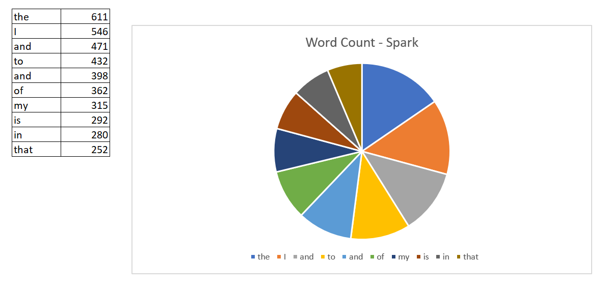

# bigdata-spark-wordcount

## Author
Jack W Beaver <br>
GitHub Profile: https://github.com/JackWBeaver

## Initialization
- The dataset I used is from Dr. Case's repository https://github.com/denisecase/setup-spark.
- The data in the text file is already clean, so I did not run any commands to clean the data.
- Run Powershell as Administrator and run the command ```.\spark-shell``` to start Spark with Scala.

## Steps for Processing data using Spark & Scala
We will be using Word Count to find the top 10 most used words in this dataset. <br>

**Step 1:** Create an RDD using a local text file on your machine
```
scala> val rjRDD = sc.textFile("C:/rj.txt.");
```
**Step 2:** Map the words then apply aggregation using reduceByKey function
```Scala
scala> val wordCount = rjRDD.flatMap(line => line.split("")).map(word => (word, 1)).reduceByKey((a,b) => a + b)
```
**Step 3:** Display the Content
```
scala> wordCount.collect()
```
**Step 4:** Sort the result in descending order
```
scala> val sortedResult = wordCount.sortBy(_._2,false);
```
**Step 5:** Write the sorted result into a local file
```
scala> def writingToAFile(f: java.io.File)(i: java.io.PrintWriter => Unit) { val j = new java.io.PrintWriter(f); try { i(j) } finally {j.close() } }
```
**Step 6:** Group the top 10 results into a value
```
scala> val top10 = sortedResult.take(10);
```
**Step 7:** Import java.io
```
scala> import java.io._
```
**Step 8:** Call the function to write into an output file
```
scala> writingToAFile(new File("C:/output.txt")) { p => top10.foreach(j.println) }
```

## Visual Representation


## References
- Spark Setup and Dataset: https://github.com/denisecase/setup-spark
- Help on Writing to a txt file: https://stackoverflow.com/questions/49067997/scala-write-rdd-to-txt-file
- Help on using the reduceByKey function: https://sparkbyexamples.com/apache-spark-rdd/spark-reducebykey-usage-with-examples/
